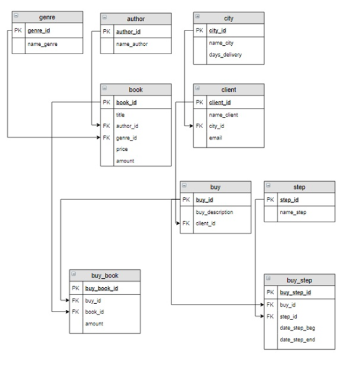

# EDU_theme_2
Учебная практика - спроектировать и создать схему базы данных, представленной на картинке ниже, с использованием SQLAlchemy и PostgreSQL.

1) genre - название жанра
2) book - название книги, цена, количество на складе, id жанра и автора
3) author - автор
4) city - город клиента и время доставки
5) client - имя клиента, почта, id города
6) buy - пожелания покупателя и id клиента
7) buy_book - таблица с количество заказа покупателей, id книг и таблицы с данными клиента
8) step - этапы обработки заказа клиента
9) buy_step - даты начала и окончания этапов обработки заказа с id данными клиента и этапа
